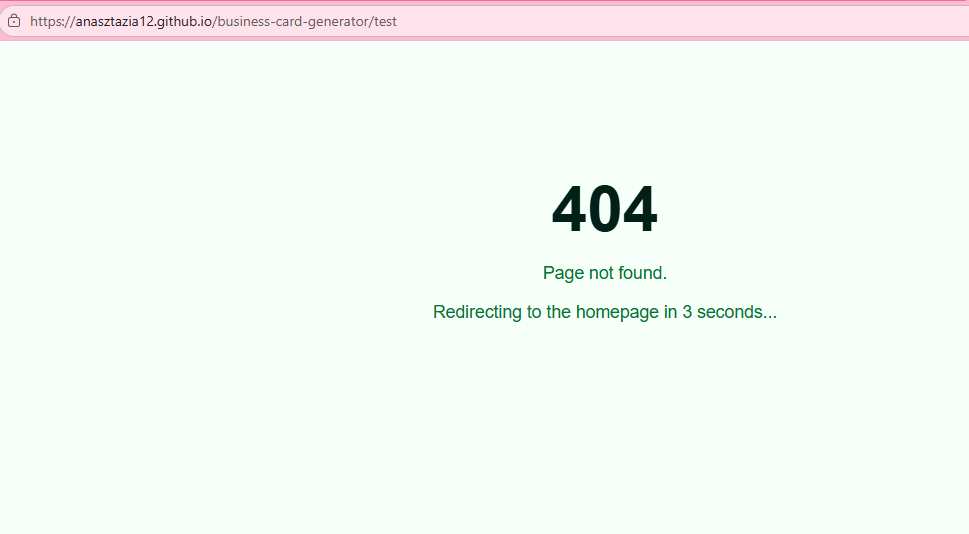
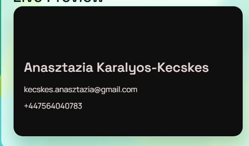
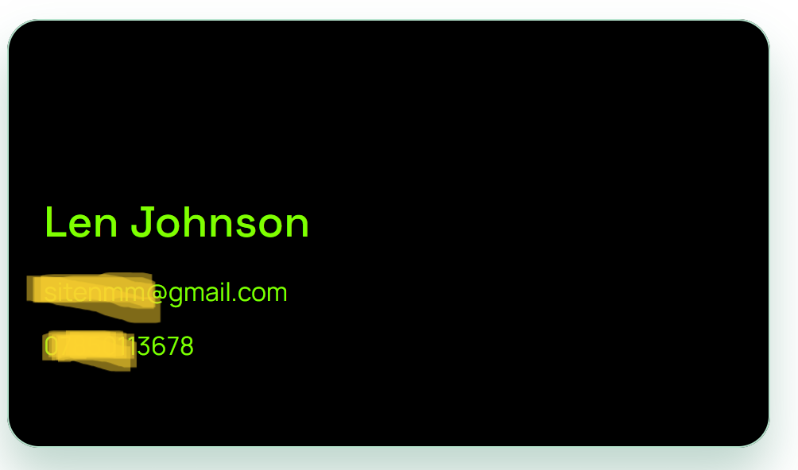
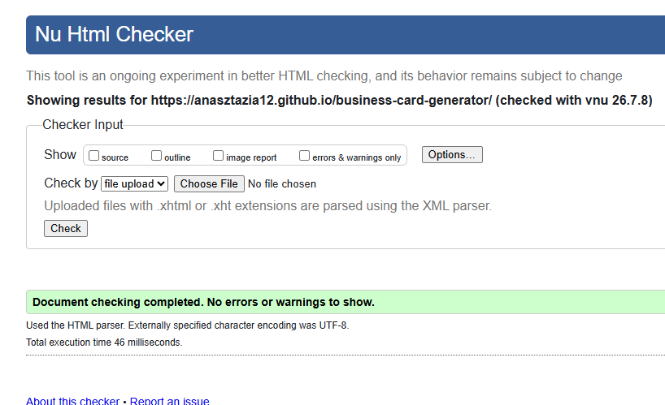
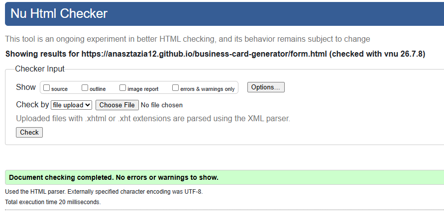
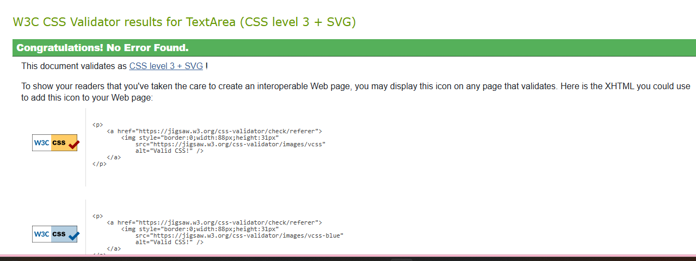
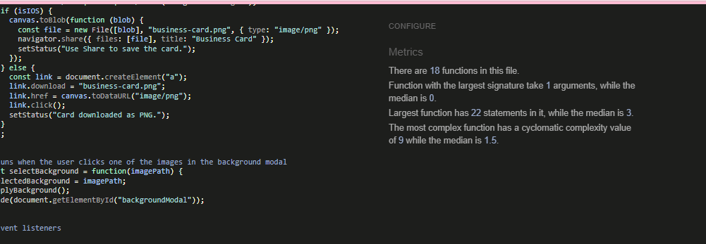

# Testing

## Testing Approach

There are two main types of testing: **manual testing** and **automated testing**.

**Manual testing** means a real person uses the website — clicking buttons, typing into forms, checking how things look — and writes down if something works or not. This is good for checking things like layout, colours and how the page feels to use.

**Automated testing** means writing small test scripts (for example using Jest) that run on their own and check if functions give the right output. This is useful when you have lots of logic to check quickly and want to catch bugs early.

I used **manual testing** for this project because most of the features are visual (live preview, background picker, card download). It made more sense to test these by actually using the site on different screen sizes and browsers rather than writing automated scripts.

---

## Manual Testing

| Feature | Test | Result |
| --- | --- | --- |
| Welcome page title | Gradient text displays correctly (green to blue) | Pass |
| Logo | Appears in top-right corner of the welcome section | Pass |
| Navigation buttons | Home and Create Card buttons visible and clickable | Pass |
| Body background | Background image covers full page and stays fixed on scroll | Pass |
| Footer | Green gradient footer visible at the bottom of the page | Pass |
| Carousel (index.html) | Images slide automatically and with prev/next buttons | Pass — was broken due to missing Bootstrap JS link, now fixed |
| Carousel arrows | Prev/next icons appear as white circles, turn teal on hover | Pass |

---

## Manual Testing – form.html (Business Card Generator)

### Live Preview

| Feature | Test | Result |
| --- | --- | --- |
| Name field | Type a name → preview name updates instantly | Pass — previously failed, fixed by adding event listeners |
| Name field empty | Clear the name → preview shows "Name" placeholder | Pass |
| Title field | Type a title → preview title appears | Pass — previously failed, fixed by adding event listeners |
| Title field empty | Clear the title → preview title disappears | Pass |
| Company field | Type a company → preview company appears | Pass — previously failed, fixed by adding event listeners |
| Company field empty | Clear the company → preview company disappears | Pass |
| Email field | Type an email → preview email updates instantly | Pass — previously failed, fixed by adding event listeners |
| Email field empty | Clear the email → preview shows `email@example.com` placeholder | Pass |
| Phone field | Type a phone number → preview phone updates instantly | Pass — previously failed, fixed by adding event listeners |
| Phone field empty | Clear the phone → preview shows "+44 1234 567890" placeholder | Pass |

### Logo

| Feature | Test | Result |
| --- | --- | --- |
| Logo upload | Upload an image → logo appears on the card preview | Pass — previously failed, fixed by adding event listeners |
| Logo upload – no file | Remove the file / reload → logo is hidden | Pass |
| Logo position – right | Select "Right" → logo appears in top-right corner | Pass — previously failed, fixed by adding event listener and CSS |
| Logo position – left | Select "Left" → logo moves to top-left corner | Pass — previously failed, fixed by adding event listener and CSS |
| Logo position change | Upload logo, then change position → logo moves without re-uploading | Pass |

### Colors & Background

| Feature | Test | Result |
| --- | --- | --- |
| Font color | Pick a color → all card text changes to that color | Pass — previously failed, fixed by adding event listener |
| Background color | Pick a color → card background changes to that color | Pass — previously failed, fixed by adding event listener |
| Background image | Open modal, click an image → card shows that background | Pass — previously failed, image was too large and not positioned; fixed by adding `backgroundSize: cover` and `backgroundPosition: center` |
| Background image – none | Click "None" in modal → card background image is removed | Pass |

### Create Card & Download

| Feature | Test | Result |
| --- | --- | --- |
| Create card – valid | Fill all required fields, click "Create Card" → tested and works | Pass |
| Create card – missing name | Leave name empty, click "Create Card" → tested and works | Pass |
| Create card – invalid email | Enter email without @, click "Create Card" → tested and works | Pass |
| Create card – missing phone | Leave phone empty, click "Create Card" → tested and works | Pass |
| Download – valid | Fill all required fields, click "Download as PNG" → tested and works | Pass |
| Download – missing fields | Leave required fields empty, click "Download" → tested and works | Pass |

### 404 Page

| Feature | Test | Result |
| --- | --- | --- |
| 404 redirect | Navigate to a non-existent URL → 404 page shows, redirects to homepage after 3 seconds | Pass |

---

## Bugs Found (Console Errors)

| Error | File & Line | Fix |
| --- | --- | --- |
| `Uncaught ReferenceError: myVariable is not defined` | script.js:141 | Removed debug `console.log(myVariable)` and `console.log("Itt járok")` — left in by accident |
| `Uncaught SyntaxError: Unexpected end of input` | script.js:141-152 | `validateForm()` missing closing `}` — `selectBackground()` was nested inside it by accident |
| CSS syntax error — `.nav-btn` not closed, `@media` blocks nested inside it | style.css:424-565 | Closed `.nav-btn` rule properly, moved both `@media` blocks to top level, removed duplicate 980px media query |
| CSS invalid value `margin: 1;` (missing unit) | style.css:175 | Changed to `margin: 0;` |
| Filename with spaces and capitals: `My Project Idea.pdf` | assets/pdf/ | Renamed to `my-project-idea.pdf`, updated README link |
| `null` reference errors on index.html — script.js tries to access form elements that don't exist on that page | script.js:4-8 | Added guard clause: script checks for `#businessCardForm` and stops if not found |
| Bootstrap JS loaded twice on form.html (head and body) | form.html:13, 153 | Removed the duplicate `<script>` tag from the body |
| `<footer>` placed after `<script>` tag | form.html:156 | Moved `<footer>` before the `<script>` tag for correct document structure |
| `Uncaught ReferenceError: downloadCard is not defined` | script.js:154 | Added missing `downloadCard()` function using html2canvas for JPG export |
| A closing `}` was in the wrong place so most of the code stopped running | script.js:158 | Moved the `}` to the bottom of the file so everything runs properly |
| Some event listeners were added twice and in the wrong place | script.js | Removed the duplicates and put all listeners together at the end |
| Background image was not showing on the card after selecting it | script.js:143 | The image loaded but was too big — added `backgroundSize` and `backgroundPosition` so it fits the card |
| Downloaded card image has a greenish tint on dark backgrounds, doesn't match the live preview | script.js (downloadCard) | The card sits inside a panel with a semi-transparent green background — `html2canvas` was picking that up and mixing it into the downloaded image. Fixed by temporarily setting the panel background to transparent before the capture, then restoring it after. The fix works correctly on most devices but the tint is still visible on some — this appears to be device/browser dependent and remains partially unfixed |

Below: the original preview vs the buggy download (left), and the fixed download working correctly on another device (right).

  

---

## Validator Testing

| Tool | File | Result |
| --- | --- | --- |
| [W3C HTML Validator](https://validator.w3.org/) | index.html | Pass — no errors or warnings |
| [W3C HTML Validator](https://validator.w3.org/) | form.html | Pass — no errors or warnings |
| [W3C CSS Validator (Jigsaw)](https://jigsaw.w3.org/css-validator/) | style.css | Pass — no errors. 3 warnings: CSS variables are not statically checked, `-webkit-background-clip` is a vendor extension, and `background-clip: text` is deprecated |
| [JSHint](https://jshint.com/) | script.js | Pass — initially 54 warnings, all resolved: added `/* jshint esversion: 6 */` to enable ES6 syntax, `/* globals html2canvas, $ */` to declare external libraries, and converted all function declarations inside blocks to function expressions (`const foo = function() {}`) |

